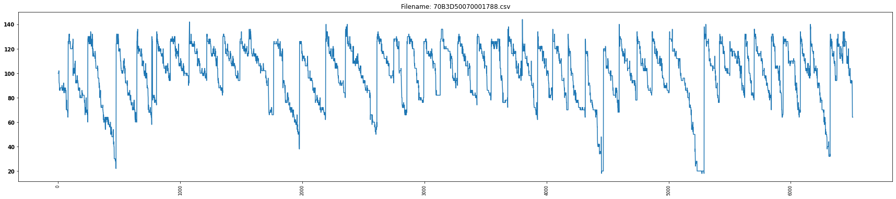
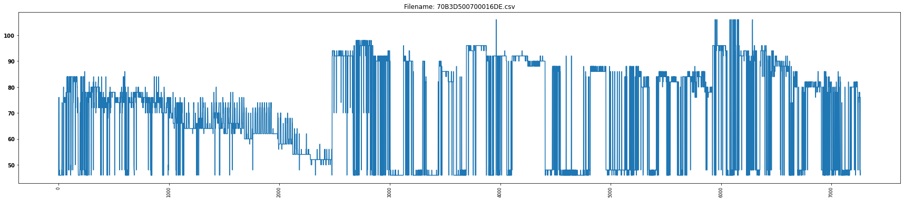
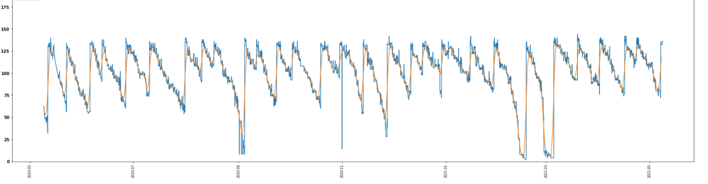
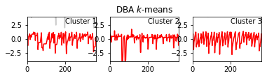
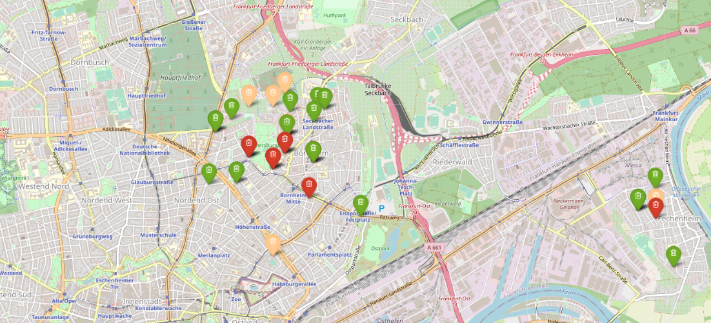
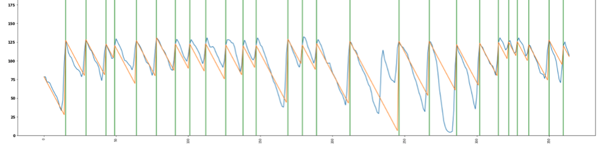
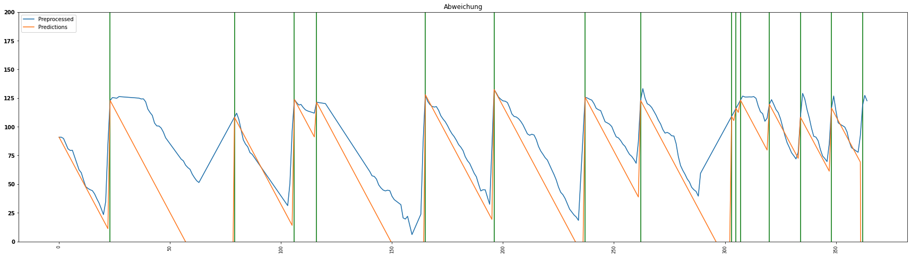
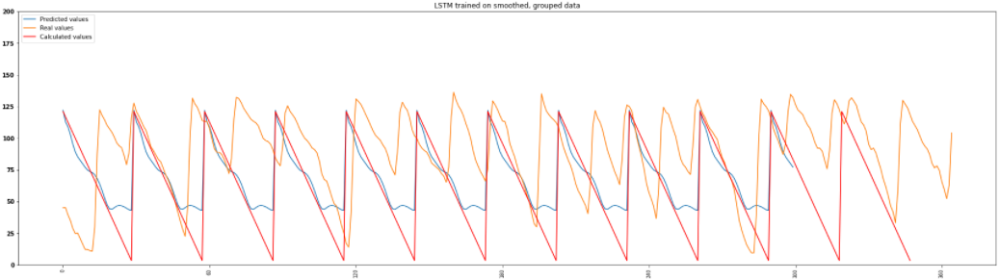

# Forecasting recycling glass growth in the city of Frankfurt

## Short project description

### 🎯 Business Unterstanding

Frankfurter Entsorgungs- und Service GmbH has equipped 72 glass containers in Frankfurt with appropriate sensor technology. Data on the fill level, the temperature in the container and the angle of inclination are collected.

The project is currently still in an exploratory phase, which means that there is no standardized approach to utilizing this data.

With the help of the data, a more efficient emptying of the containers should be possible. Therefore, a supporting prediction model has to be developed, which can make statements about the filling behavior of the containers.

## 📊 Data Understanding

The data are time series that result from the observation of individual variables over a period of time. The decisive variable **height** is observed with varying frequency, but on average several times per day. However, since these are EDGE devices, individual measurements are not always accurate and, in addition, missing data is common. Thus the quality of measurements for different containers can vary strongly. In the following picture the filling level of a container can be observed over the provided period.



[DataVisualisation.ipynb](https://git.scc.kit.edu/uflgi/bda-analytics-challenge-template/-/blob/master/notebooks/DataVisualization.ipynb)

To better understand influences on the filling level, we obtained different data sources from the Internet and tested them for their influence using a correlation analysis.

Data sources examined:

☁️  Weather data - intuition: glass tends to be disposed of more in good weather than in rain. Who likes to leave the house when it rains?

🎉  Holidays - intuition: Over holidays people like to get together, which could lead to an increased emergence residual glass (wine bottles, etc.)

⚽  Soccer matches & major events - intuition: The number of people in the city increases at soccer matches and other major events. Here, too, alcohol is increasingly consumed and possibly disposed of directly in glass containers lying on the way.

[webscraper.ipynb](https://git.scc.kit.edu/uflgi/bda-analytics-challenge-template/-/blob/master/notebooks/webscraper.ipynb)

## 📈  Data Preparation

Since the quality of the model's predictions is directly related to the quality of the training data, it was important to prepare the data as well as possible for training.

After all container levels were visualized, containers whose data quality was extremely questionable were sorted out via descriptive analysis. The following plots show an example of a sorted out container (bottom) and a used container (top).




In the next steps, obvious measurement errors were removed from the containers, e.g. height > 190. Since the data still contain a lot of noise, the underlying trend had to be extracted. Different smoothing methods were applied. In the code snippet as well as in the graphic below the smoothing method of the rolling average with a window size of 30 was visualized.

```python
df['mov_avg'] = df['Height'].rolling(30).mean()
```



In addition, after initial modeling attempts failed, we aggregated the data at the daily level using mean(), min() and max() operators. In doing so, the mean() results were closer to the raw trend than the others, which is why this data was used for the rest of the procedure. 
Since most containers did not have readings for each day, we filled in missing readings using interpolation techniques.

### 🌀 Clustering

Since the descriptive analysis showed that there are visual similarities between the time series, we wanted to group them into clusters and train a model for each cluster in order to increase the goodness of each and thus the overall prediction quality. 

Dynamic Time Warping in combination with K-means Clustering was used for this purpose. For this the library [tslearn](https://tslearn.readthedocs.io/en/stable/gen_modules/clustering/tslearn.clustering.TimeSeriesKMeans.html) was used. Here, **k = 3** emerged as the most effective number for the clusters.





[preprocessing_clustering.ipynb](https://git.scc.kit.edu/uflgi/bda-analytics-challenge-template/-/blob/master/notebooks/preprocessing_clustering.ipynb)

[data_preprocessing.ipynb](https://git.scc.kit.edu/uflgi/bda-analytics-challenge-template/-/blob/master/notebooks/data_preprocessing.ipynb)

[mapsVizualization.ipynb](https://git.scc.kit.edu/uflgi/bda-analytics-challenge-template/-/blob/master/notebooks/mapsVizualization.ipynb)

## 🤖 Modelling

### Lineare Regression als Baseline

❗ The main problems for modeling are the rather poor data quality and the changing locations of the containers.

It does not make sense to empty the actual curves with their respective emptying intervals, since it is precisely these that are to be adjusted.

As a baseline, we tried to model this using a simple linear regression. In each case, a fill interval was extracted from a time series per cluster and the slope was calculated on it. This also led to very promising results for this rather simple method. To evaluate the results, we tried to calculate the respective voids using a threshold function. This works on different time series with strongly varying success.





At first glance, the procedure actually looks very appealing, but it cannot be optimally evaluated because the data do not specify the times of emptying at all, or very poorly.

**This would require data that includes the correct emptying times.** 

[linear_regression.ipynb](https://git.scc.kit.edu/uflgi/bda-analytics-challenge-template/-/blob/master/notebooks/performing_linear_regression.ipynb)

[linearRegression.ipynb](https://git.scc.kit.edu/uflgi/bda-analytics-challenge-template/-/blob/master/notebooks/linearRegression.ipynb)

### LSTM

Three approaches for a LSTM were followed: 
    1. LSTM based on a cluster with data for each hour (notebook: Cluster0_LSTM.ipynb, model: 
    2. LSTM based on all clusters with data for each hour (Notebook: Overall_LSTM.ipynb, model: 
    3rd LSTM based on all clusters with data for each day (Notebook: Overall_grouped_LSTM.ipynb, Model: 
    
Only approach 3. generates matching predictions: 



Here, the LSTM learns the filling behavior of all containers. We perform the emptying manually by resetting the input values for the LSTM to an empty container as soon as the fill level remains the same for several predictions.

This approach would also be possible for individual containers with additional fill level data.

## 🚀 Fazit/Future Work

Linear regression already captures the development of the level very well in many cases, which indicates that the level does not follow a complex function and therefore tends to be based on a trend that is relatively easy to model.

❗ However, no outlier levels were taken into account. The capacity of a simple regression is not high enough to model these. 

The bottleneck for the evaluation here is clearly the correct time of emptying. With our simple threshold function, we are not able to approximate this accurately enough.

→ The sensor documentation says that these should be included, but we could not observe this in the data. For this, either the sensor can be adjusted or to make more out of the data, we would suggest to manually label a part of the data and then train a model via supervised learning, which is able to specify the emptying times more precisely. Unfortunately, this idea came too late for us and could not be implemented within the scope of this project.


## Special Stuff
Our LSTM model was trained on Google Colab. The data split and model training is not performed in the notebooks, but 
the processed is visualized. The whole functionality can be found in the src folder.


## Project Organization
------------
```
	├── README.md 							<-- this file. insert group members here
	├── .gitignore 						    <-- prevents you from submitting several clutter files
	├── data
	│   ├── modeling
	│   │   ├── dev 						<-- your development set goes here
	│   │   ├── test 						<-- your test set goes here
	│   │   └── train 						<-- your train set goes here goes here
	│   ├── preprocessed 					<-- your preprocessed data goes here
	│   └── raw								<-- the provided raw data for modeling goes here
	├── docs								<-- provided explanation of raw input data goes here
	│
	├── models								<-- dump models here
	├── notebooks							<-- your playground for juptyer notebooks
	├── requirements.txt 					<-- required packages to run your submission (use a virtualenv!)
	└── src
	    ├── additional_features.py 			<-- your creation of additional features/data goes here
	    ├── cluster.py 						<-- code for clustering
	    ├── regression.py 					<-- regression model
	    ├── preprocessing.py 				<-- your preprocessing script goes here
	    ├── train.py 						<-- your training script goes here
	    └── predict.py 						<-- prediction script for LSTM
	
```

